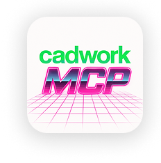

<div align="center">
  
  <h1 style="margin: 0;">cadworkMCP</h1>
</div>

<p align="center">
  <a href="https://www.python.org/downloads/release/python-3100/"></a>
  <a href="LICENSE"></a>
</p>

## Table of Contents
- [Table of Contents](#table-of-contents)
- [Demo Videos](#demo-videos)
- [Overview](#overview)
- [Architecture](#architecture)
- [Getting Started](#getting-started)
  - [Prerequisites](#prerequisites)
  - [Important Requirements](#important-requirements)
  - [Setup and Usage](#setup-and-usage)
- [Features and Tools](#features-and-tools)
- [How to Add a New Tool to cadworkMCP](#how-to-add-a-new-tool-to-cadworkmcp)
  - [Example: Adding a Tool to Set a User Attribute](#example-adding-a-tool-to-set-a-user-attribute)
    - [1. Update `mcp_cadworks_bridge.py`](#1-update-mcp_cadworks_bridgepy)
    - [2. Update `mcp_server.py`](#2-update-mcp_serverpy)
    - [3. Test Your Tool](#3-test-your-tool)
- [Retrieval-Augmented Generation (RAG) Integration](#retrieval-augmented-generation-rag-integration)
- [Hackathon Context](#hackathon-context)
- [Contribution](#contribution)
- [Authors](#authors)
- [Acknowledgments](#acknowledgments)
- [License](#license)
- [Tool Reference](#tool-reference)

## Demo Videos

Watch these videos to see the cadwork MCP server in action:

<table>
  <tr>
    <td>Identifying Trucks<br></td>
  </tr>
  <tr>
    <td>Finding Materials<br></td>
  </tr>
</table>


## Overview

The **cadworkMCP** project is an MVP (Minimum Viable Product) developed during the [**Hackathon Digital Prefabrication Challenge 2025**](https://www.intcdc.uni-stuttgart.de/news-events/events/detail/Hackathon-Digital-Prefabrication-Challenge-00001/)  (April 25–27, 2025). It creates a Model Context Protocol (MCP) server for Cadwork, enabling AI hosts like Claude or Cursor to interact conversationally with a BIM model inside a running Cadwork instance. This allows users to retrieve and manipulate model data programmatically, enhancing workflows in digital prefabrication and timber construction. The solution was developed in response to a challenge presented by Egoin, a timber construction company.

## Architecture

The system enables MCP-aware agents (like Cursor or Claude) to create, query, or modify a live Cadwork 3D model in real time. All Cadwork editing logic remains inside Cadwork (Python plug-in), while a lightweight HTTP/JSON façade exposes the interface for agents. All write operations are sandboxed within Cadwork; the HTTP service never touches model files directly, minimizing data-loss risk.

It consists of two main parts:
1.  **Cadwork Bridge (`mcp_cadworks_bridge.py`):** A Python script running *inside* Cadwork via its API plug-in. It listens on a local socket (`127.0.0.1:<port>`) for commands, translates JSON to Cadwork API calls, and returns JSON responses. It runs in a background thread to keep the Cadwork UI responsive. The bridge can be run via the Python IDLE plugin for Cadwork (https://docs.cadwork.com/projects/cwapi3dpython/en/latest/get_started/).
2.  **MCP Server (`mcp_server.py`):** An external Python server (using FastAPI via `mcp.server.fastmcp`) that exposes MCP tools. When an AI host calls a tool, this server translates the request and sends it to the Cadwork Bridge via the socket connection. This allows multiple agents to share a Cadwork instance.

This separation keeps Cadwork-specific logic within the Cadwork environment while providing a standard MCP interface for external agents.

## Getting Started

### Prerequisites

1.  **Python**: Version 3.10 or later. ([python.org](https://www.python.org/))
2.  **Cadwork**: A running instance of Cadwork v27+ with its Python API plug-in enabled.
3.  **Virtual Environment**: Recommended for managing dependencies. See [Python venv documentation](https://docs.python.org/3/library/venv.html).

### Important Requirements

- **Python Version:** You must use Python 3.10 or higher for the MCP server to work correctly. Check your version with:
  ```bash
  python3 --version
  ```
  If you have an older version, download and install the latest Python from [python.org](https://www.python.org/downloads/).

### Setup and Usage

1.  **Clone the Repository:**
    ```bash
    git clone <repository-url>
    cd DigiPrefabChallenge25
    ```
2.  **Set up Cadwork Bridge:**
    *   Run the `mcp_cadworks_bridge.py` script within Cadwork (e.g., via the Python IDLE plugin). Verify it shows "listening…" in the socket message.
3.  **Set up MCP Server:**
    *   Open a terminal in the project directory.
    *   Create and activate a virtual environment:
        ```bash
        # Windows
        python -m venv venv
        .\venv\Scripts\activate
        # macOS/Linux
        python3 -m venv venv
        source venv/bin/activate
        ```
    *   Install dependencies:
        ```bash
        pip install -r requirements.txt
        # Or using uv:
        # uv pip install -r requirements.txt
        ```
        *(Note: The default port is 53002. Override with the `CW_PORT` environment variable if needed.)*
4.  **Configure your AI Host (e.g., Cursor or Claude):**
    *   Set up your AI host to connect to the running MCP server (typically `http://127.0.0.1:53002`).
        *   For **Cursor**, follow the [MCP setup guide](https://docs.cursor.com/context/model-context-protocol).
        *   For **Claude**, refer to the [MCP Use documentation](https://docs.anthropic.com/en/docs/agents-and-tools/mcp).
    *   For Cursor, you can create a `.cursor/mcp.json` file in the project root or your home directory (`~/.cursor/`) to make the server discoverable:
      ```json
        {
          "mcpServers": {
            "cadwork": {
              "command": "python",
              "args": [
                "C:\\Users\\SSlezak\\Documents\\github\\DigiPrefabChallenge25\\mcp_server.py",
                "mcp_server.py",
                "--transport",
                "http",
                "--port",
                "8001"
              ],
              "env": {
                "CW_PORT": "53002"
              },
              "uri": "http://localhost:8001"
            }
          }
        }
      ```
      Adjust `host` and `port` if necessary.
5.  **Interact:** Once connected, ask the AI host to perform actions using the available tools (see below). The AI host will call the corresponding tools on the MCP server, which communicates with Cadwork via the bridge to execute the actions or retrieve information.

     *Use case: In your prefered host environment (cursor most likely), you can write a prompt like you would when using chatGPT. It is a good practice to give context in your prompt that you would like to execute something with cadworkMCP.*

## Features and Tools

- **Interactive MCP Server**: Facilitates communication between Cadwork and external tools or hosts.
- **BIM Model Interaction**: Retrieve, modify, and query BIM model data programmatically.
- **Available Tools**:
    *   `get_cadwork_version_info`: Get version details from Cadwork and the plug-in.
    *   `create_beam`: Create a new rectangular beam element.
        - Example Args: `{"p1": [0, 0, 0], "p2": [10, 0, 0], "width": 0.2, "height": 0.3}`
    *   `get_element_info`: Retrieve geometry and attribute information for a specific element ID.
    *   `get_active_element_ids`: Get IDs of currently selected elements in Cadwork.
    *   `get_standard_attributes`: Get common attributes (name, group, material, etc.) for an element ID.
    *   `get_user_attributes`: Get specific user-defined attributes for an element ID.
    *   `list_defined_user_attributes`: List all user-defined attributes configured in the current Cadwork environment.

## How to Add a New Tool to cadworkMCP

You can extend cadworkMCP by adding new tools that expose Cadwork API functionality to external agents. This is done by:

1. **Identifying the Cadwork API function you want to expose** (see the [Cadwork Python API docs](https://docs.cadwork.com/projects/cwapi3dpython/en/latest/)).
2. **Adding a handler in `mcp_cadworks_bridge.py`** that calls the relevant Cadwork API/controller function.
3. **Registering a new tool in `mcp_server.py`** that sends the operation to the bridge and returns the result.

### Example: Adding a Tool to Set a User Attribute

Suppose you want to add a tool to set a user attribute on elements using the [attribute_controller](https://docs.cadwork.com/projects/cwapi3dpython/en/latest/documentation/attribute_controller/):

#### 1. Update `mcp_cadworks_bridge.py`
- Add a new operation in the `handle` function:

```python
if op == "set_user_attribute":
    try:
        element_ids = args["element_id_list"]
        number = args["number"]
        value = args["user_attribute"]
        ac.set_user_attribute(element_ids, number, value)
        return {"status": "ok"}
    except Exception as e:
        return {"status": "error", "message": str(e)}
```

#### 2. Update `mcp_server.py`
- Register a new tool:

```python
@mcp.tool(
    name="set_user_attribute",
    description="Sets a user attribute value for a list of element IDs. Args: element_id_list (list of int), number (int), user_attribute (str)."
)
async def set_user_attribute(element_id_list: list, number: int, user_attribute: str) -> dict:
    connection = get_cadwork_connection()
    args = {"element_id_list": element_id_list, "number": number, "user_attribute": user_attribute}
    return connection.send_command("set_user_attribute", args)
```

#### 3. Test Your Tool
- Restart both the Cadwork bridge and the MCP server.
- Call your new tool from your AI host or via HTTP.

**Tip:** Refer to the [Cadwork Python API documentation](https://docs.cadwork.com/projects/cwapi3dpython/en/latest/) and the [attribute_controller reference](https://docs.cadwork.com/projects/cwapi3dpython/en/latest/documentation/attribute_controller/) for available functions and their signatures.

## Retrieval-Augmented Generation (RAG) Integration

This project includes an optional RAG (Retrieval-Augmented Generation) component for enhanced BIM data interaction using natural language.


## Hackathon Context

This project was developed as part of the [**Hackathon Digital Prefabrication Challenge 2025**](https://www.intcdc.uni-stuttgart.de/news-events/events/detail/Hackathon-Digital-Prefabrication-Challenge-00001/) (April 25–27, 2025), organized by the [Cluster of Excellence IntCDC](https://www.intcdc.uni-stuttgart.de/), [digitize wood](https://www.digitize-wood.de/en-us)
and the University of British Columbia. The hackathon focused on digital prefabrication in timber construction, with participation from companies like Blumer Lehmann, Renggli, Strong by Form, Egoin, and others.

## Contribution

This project is an MVP and welcomes contributions. Feel free to fork the repository and submit pull requests.

## Authors

- **Client:** Lui Orozco ([Egoin](https://egoin.com/en/))
- **Tutor:** Lasath Siriwardena ([Institute for Computational Design and Construction - ICD](https://www.icd.uni-stuttgart.de/team/siriwardena))
- **Technical Support:** Rainer Abt ([cadwork](https://cadwork.de/))

**Team:**
- Sasipa Vichitkraivin
- Max Maier
- Samuel Slezak
- Hyo Wook Kim

## Acknowledgments

Special thanks to the organizers, mentors, and participants of the IntCDC Hackathon Digital Prefabrication Challenge 2025.

## License

This project is licensed under the MIT License - see the [LICENSE](LICENSE) file for details.

## Tool Reference

| Tool Name                  | Arguments                                 | Returns         | Description                                  |
|---------------------------|-------------------------------------------|-----------------|----------------------------------------------|
| get_cadwork_version_info  | None                                      | Dict            | Get Cadwork and plugin version info          |
| create_beam               | p1, p2, width, height, [p3]               | Dict (id)       | Create a new beam in the model               |
| get_element_info          | element_id                                | Dict            | Get geometry and attributes for an element   |
| get_active_element_ids    | None                                      | Dict (element_ids) | Get IDs of currently selected elements   |
| get_standard_attributes   | element_ids (list)                        | Dict            | Get standard attributes for elements         |
| get_user_attributes       | element_ids (list), attribute_numbers (list) | Dict         | Get user-defined attributes for elements     |
| list_defined_user_attributes | None                                   | Dict            | List all user-defined attributes             |
